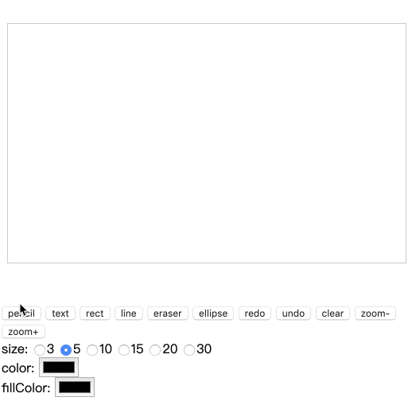

# drawingBoard
The goal is to implement a canvas drawing board library with Javascript

## Use
```
  <div class="drawing-board-box">
    <canvas id="board" width="500" height="300"></canvas>
  </div>
  ...

  var oBoard = document.getElementById('board');
  new DrawingBoard(oBoard, options?);
```

## Options
| Param |Available value |
| ------------- | ------------- |
| currentTool  | 'pencil', 'text', 'rect', 'line', 'eraser'  |

## Tools
- [x] Pencil
- [x] Line
- [x] Eraser
- [x] Rect
- [x] Text
- [ ] Color
- [ ] Size
- [ ] Zoom
- [ ] Image
- [ ] ...

## Demo
Please click [here](./index.html)
---


## License

MIT
